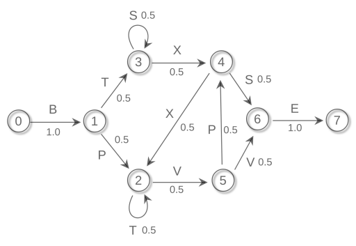

### Cloned Hidden Markov Model

##### Структура проекта:

```chmm/
    configs/
        --hmm_default.yaml
        --hmm_runner.yaml
        --mpg_default.yaml
    mylib/
        --__init__.py
        --chmm.py
        --mpg.py
        --hmm_runner.py
```

`mylib/chmm.py` --- содержит класс `CHMM` в котором нужно дописать методы, чтобы выполнить задание

`mylib/mpg.py` --- генератор последовательностей символов, соответствующих марковскому процессу, представленному на рисунке. Ноды данной сети представляют собой скрытые состояния процесса, стрелочки --- возможные переходы между ними. Цифры около стрелок указывают вероятность перехода, а буквы --- генерируемые символы в результате данного перехода. Таким образом, данный марковский процесс задаёт некоторую грамматику.

 


Примеры возможных последовательностей:

* BTXSE
* BPTTTTVVE
* BTSSSXXVVE

и так далее.

`mylib/hmm_runner.py` --- содержит класс `HMMRunner`, запускающий `CHMM` на последовательностях, сгенерированных в ходе марковского процесса. Здача модели --- научиться минимизировать неожиданность входных наблюдений. В ходе обучения вычисляются метрики качества: неожиданность ($-\log P(o)$), расстояние Кульбака-Лейблера и строится сглаженный портрет предсказываемых распределений в каждом состоянии марковского процесса.  

`configs/hmm_default.yaml` --- здесь можно менять/добавлять параметры для класса `CHMM`

`configs/hmm_runner.yaml` --- параметры запуска эксперимента

`configs/mpg_default.yaml` --- параметры `MPG`

`start_script.py` --- пример запуска эксперимента с помощью `HMMRunner` 
#### Задание:

1. Прочитать [статью](http://arxiv.org/abs/1905.00507).
2. Установить пакеты из `requirements.txt`
3. Реализовать _CHMM_, дописав методы в `chmm.py`. Можно написать свой класс, главное, чтобы были методы и атрибуты, используемые в `hmm_runner.py`, который запускает тестирование модели. Самостоятельно реализовать онлайн вариант алгоритма Баума-Вельша (Baum-Welch), описанный в статье из пункта 1.
4. Из библиотеки [hmmlearn](https://hmmlearn.readthedocs.io/en/latest/) запустить готовую реализацию `HMM` для этой же задачи и сравнить с реализацией `CHMM`, полученной во втором пункте.

__Замечания__

_Результатом работы должен быть код в `chmm.py` и логи из [`wandb`](https://wandb.ai/site) проекта._ 

_Логгинг в `wandb` уже реализован, нужно только определить `WANDB_ENTITY` переменную в окружении, в которую нужно записать имя аккаунта в `wandb`._

_Задачу можно решать и в свободной форме (без использования `hmm_runner.py`), главное, чтобы были понятные графики обучения и полученных распределений. Но желательно научиться работать с какой-нибудь системой логирования._